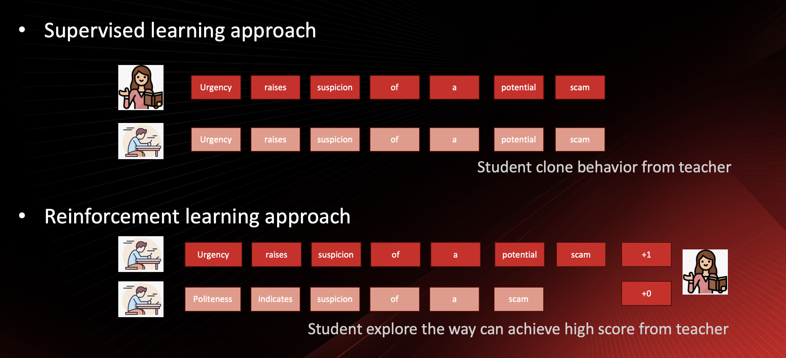

# TinyZero - ScamR1: Reasoning Without Overthinking  

## Aha Moment  

DeepSeek and Berkeley's Jiayi Pan's TinyZero remind us of the groundbreaking moment when AlphaGo emerged. Reinforcement learning presents opportunities to train AI models that outperform experts and achieve state-of-the-art performance in targeted metrics. We have witnessed success stories in domains such as Go, the Method game, and Jiayi's Countdown game, where clear and cost-effective rules enable quick and accurate reward feedback.



Previously, we applied supervised fine-tuning, where immediate rewards adjust model weights token by token, making training efficient. This allows the student model to rapidly replicate the teacher’s behavior. However, the challenge lies in whether the acquired knowledge can generalize to other tasks. In supervised learning, the student model can only approximate the teacher’s behavior and struggles to surpass it.

On the other hand, reinforcement learning enables the student to generate its own chain of thoughts and strive for the best possible outcome. The teacher provides feedback on both positive and negative cases, and the student learns from these rewards to adjust its weights. This process is sometimes akin to black magic. However, when the model successfully identifies which aspects contribute to the final decision, it improves—leading to an "aha!" moment.

## Cybersecurity Reasoning Task  

In cybersecurity, we explore whether we can identify a problem that fits within this framework. After experimenting with various tasks, we introduce ScamR1, which applies reinforcement learning to reasoning and scam detection.

Can an AI model analyze a message and determine whether it is a scam?

  

In this work, we extend [TinyZero](https://github.com/Jiayi-Pan/TinyZero) to **SCAM reasoning and detection**, enhancing its applicability in cybersecurity.  

## 🔍 Key Enhancements  

### 1️⃣ SCAM Reasoning & Detection  
- **Scam Data Generator**: Generates synthetic scam scenarios for training.  
- **Reward Scoring**: Enhances scam detection accuracy through reinforcement learning.  

### 2️⃣ Results & Observations  
- **Validation confirms no overfitting.**  
- **Significant improvements observed within the first 200 steps**, particularly in **format alignment**.  
- **Response length stabilizes at ~150 tokens** after an initial reduction.  

## ⚙️ Installation  

```bash  
conda create -n zero python=3.9  
pip install torch==2.4.0 --index-url https://download.pytorch.org/whl/cu121  
pip install vllm==0.6.3 ray  
pip install -e .  # verl  
pip install flash-attn --no-build-isolation  
pip install wandb IPython matplotlib  
```

## 🚀 SCAM Task  

### 🛠 Data Preparation  

```bash  
conda activate zero  
python ./examples/data_preprocess/scam.py --local_dir {path_to_your_dataset}  
```

### 🎯 Run Training  

```bash  
conda activate zero  
export N_GPUS=2  
export BASE_MODEL={path_to_your_model}  
export DATA_DIR={path_to_your_dataset}  
export ROLLOUT_TP_SIZE=2  
export EXPERIMENT_NAME=scam-detection  
export VLLM_ATTENTION_BACKEND=XFORMERS  

bash ./scripts/train_tiny_zero.sh  
```

## 🔗 Acknowledgments  

- Built upon [TinyZero](https://github.com/Jiayi-Pan/TinyZero).  
- Utilizes the [veRL](https://github.com/volcengine/verl) framework.  

## 📜 Citation  

If referencing this work, please cite:  

```bibtex  
@misc{tinyzero_scamr1,  
  author       = {Spark Tsao},  
  title        = {ScamR1: Reasoning Without Overthinking},  
  howpublished = {https://github.com/SparkTsao/TinyZero-ScamR1},  
  note         = {Accessed: 2025-02-22},  
  year         = {2025}  
}  
```
